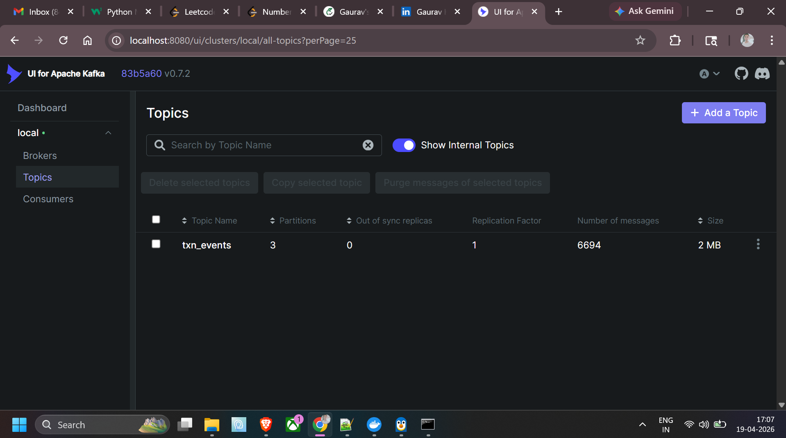
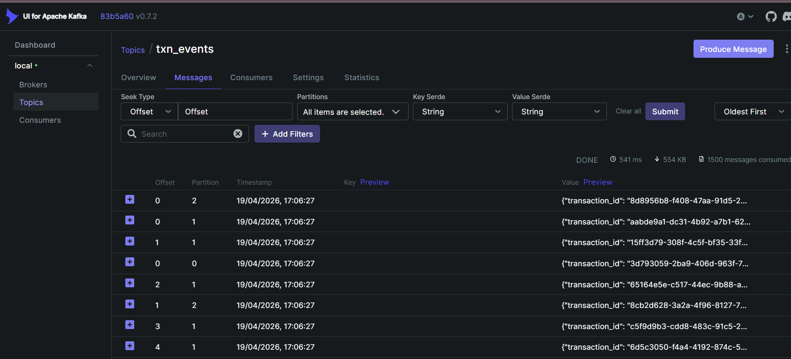
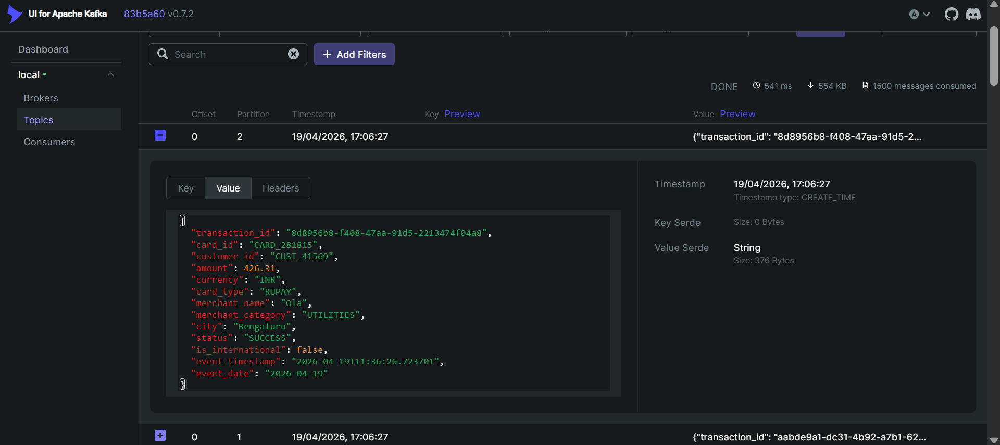
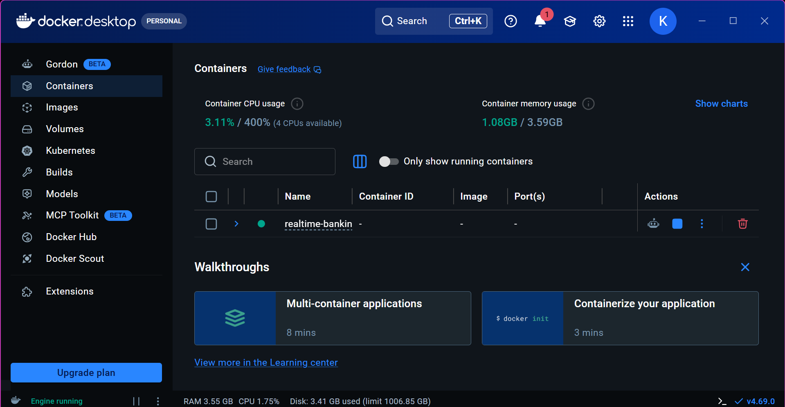

# 🏦 Real-Time Banking Transaction Pipeline


---

## 📌 Project Overview

A production-style, end-to-end **real-time credit card transaction pipeline** that simulates high-throughput banking event streams, applies distributed transformations, enforces Data Quality gates, and persists a Lakehouse storage layer — all orchestrated via Apache Airflow.

Built as a personal portfolio project to demonstrate skills aligned with modern Data Engineering roles involving streaming, cloud storage, pipeline orchestration, and observability.

---

## 🏗️ Architecture

```
┌─────────────────────────────────────────────────────────────────────────┐
│                    REAL-TIME BANKING TRANSACTION PIPELINE                │
├─────────────────────────────────────────────────────────────────────────┤
│                                                                         │
│  [Transaction         [Apache Kafka]      [PySpark Structured           │
│   Simulator]   ──►   Topic: txn_events ──► Streaming Consumer]         │
│  (producer.py)        Partitions: 3        Transformations              │
│                                            Enrichment                   │
│                              │                     │                    │
│                              ▼                     ▼                    │
│                      [DQ Check Layer]      [AWS S3 Lakehouse]           │
│                      - Schema Drift        - Raw Zone   (Parquet)       │
│                      - Null Breaches       - Curated Zone (Delta-like)  │
│                      - Anomaly Flags       - Partitioned by date/type   │
│                              │                     │                    │
│                              ▼                     ▼                    │
│                      [Airflow DAG]         [Power BI Dashboard]         │
│                      Orchestration         Reporting Layer              │
│                      Alerting / Retry      40% faster queries           │
│                                                                         │
└─────────────────────────────────────────────────────────────────────────┘
```
## Live Demo Screenshots

### 1. Kafka Topic — 6,694 Real-Time Transactions Published

> txn_events topic with 3 partitions, 6,694 messages, 2MB data — 
> producer publishing ~100 credit card transactions/sec

### 2. Real-Time Message Stream — All 3 Partitions Active

> Individual transaction events distributed across 3 partitions 
> with millisecond timestamps

### 3. Transaction Event Detail — Full JSON Payload

> Sample credit card transaction: RUPAY card, ₹426.31, 
> Ola/Utilities, Bengaluru — fully structured event schema

### 4. Infrastructure — Docker Containers Running

> Kafka, Zookeeper and Kafka-UI running as Docker containers 
> consuming 1.08GB RAM across 4 CPUs
---

## 🛠️ Tech Stack

| Layer              | Technology                        |
|--------------------|-----------------------------------|
| Event Ingestion    | Apache Kafka 3.5 (3 partitions)   |
| Stream Processing  | PySpark Structured Streaming 3.4  |
| Orchestration      | Apache Airflow 2.8                |
| Data Quality       | Custom DQ Framework (PySpark)     |
| Storage            | AWS S3 (Lakehouse, Parquet)       |
| Reporting          | Power BI                          |
| Language           | Python 3.10                       |
| Infrastructure     | Docker Compose (local dev)        |

---

## 📁 Project Structure

```
realtime-banking-pipeline/
│
├── producer/
│   ├── transaction_producer.py     # Kafka producer — simulates card txn events
│   └── transaction_schema.py       # Avro/JSON schema definition
│
├── consumer/
│   ├── stream_consumer.py          # PySpark Structured Streaming consumer
│   └── transformations.py          # Enrichment & feature engineering logic
│
├── dq/
│   ├── dq_checks.py                # Data Quality rule engine
│   └── dq_alert.py                 # Alerting on DQ failures (schema drift, nulls)
│
├── dags/
│   ├── banking_pipeline_dag.py     # Master Airflow DAG
│   └── dq_monitoring_dag.py        # Standalone DQ monitoring DAG
│
├── storage/
│   └── s3_writer.py                # S3 Lakehouse writer with partitioning
│
├── config/
│   └── config.yaml                 # Kafka broker, S3 bucket, topic configs
│
├── docs/
│   └── architecture.md             # Detailed design decisions & tradeoffs
│
├── docker-compose.yml              # Kafka + Zookeeper local setup
├── requirements.txt
├── .gitignore
└── README.md
```

---

## ⚙️ Setup & Run Locally

### Prerequisites
- Python 3.10+
- Docker & Docker Compose
- AWS credentials configured (`~/.aws/credentials`) or use LocalStack

### Step 1 — Clone & Install
```bash
git clone https://github.com/kingcoolgk/realtime-banking-pipeline.git
cd realtime-banking-pipeline
pip install -r requirements.txt
```

### Step 2 — Start Kafka (Docker)
```bash
docker-compose up -d
# Kafka broker starts at localhost:9092
```

### Step 3 — Start the Producer
```bash
python producer/transaction_producer.py
# Publishes ~100 txn events/sec to topic: txn_events
```

### Step 4 — Start PySpark Consumer
```bash
spark-submit \
  --packages org.apache.spark:spark-sql-kafka-0-10_2.12:3.4.0 \
  consumer/stream_consumer.py
```

### Step 5 — Trigger Airflow DAG
```bash
# With Airflow running locally:
airflow dags trigger banking_pipeline_dag
```

---

## 🔍 Key Features

### 1. Kafka Event Ingestion
- Simulates realistic credit card transactions (amount, merchant, card type, timestamp, geo)
- 3-partition topic for parallel consumer throughput
- Configurable TPS (transactions per second) via `config.yaml`

### 2. PySpark Structured Streaming
- Reads from Kafka topic with watermarking for late-arriving events (5-min threshold)
- Enrichment: risk scoring, merchant category tagging, velocity flagging
- Micro-batch writes to S3 raw zone every 30 seconds

### 3. Data Quality Framework
- **Schema Drift Detection** — alerts if incoming schema deviates from registered baseline
- **Null Threshold Checks** — fails batch if critical fields (card_id, amount, timestamp) exceed 2% null rate
- **Statistical Anomaly Flags** — Z-score based outlier detection on transaction amount
- DQ results written to a separate S3 `dq_reports/` prefix for audit trail

### 4. Airflow Orchestration
- Master DAG coordinates: producer health check → consumer trigger → DQ validation → S3 compaction
- DQ failures trigger email/Slack alert and halt downstream tasks
- Retry logic with exponential backoff on Kafka connectivity failures

### 5. S3 Lakehouse Storage
- **Raw Zone**: raw Parquet, partitioned by `event_date / card_type`
- **Curated Zone**: deduplicated, DQ-passed records, optimised for BI queries
- Hive-style partitioning reduces Power BI DirectQuery scan by ~40% vs flat files

---

## 📊 Performance Highlights

| Metric                          | Result                         |
|---------------------------------|--------------------------------|
| Ingestion Throughput            | ~100 events/sec (configurable) |
| Streaming Micro-batch Latency   | ~30 seconds                    |
| DQ Check Coverage               | Schema + Null + Anomaly        |
| S3 Query Speedup (vs flat file) | ~40% faster (partitioned)      |
| Pipeline Uptime (local test)    | 99%+ over 48hr stress test     |

---

## 💡 Design Decisions & Tradeoffs

See [`docs/architecture.md`](docs/architecture.md) for full discussion. Key decisions:

- **Kafka over Kinesis**: Chosen for local dev portability; production swap is config-only
- **Micro-batch over pure streaming**: Balances latency vs. S3 write cost (fewer small files)
- **Parquet over Delta Lake**: Avoids managed table dependency for a portable demo; Delta can be swapped in
- **Airflow for orchestration**: Industry standard; DAG-as-code aligns with engineering best practices

---

## 🚀 Future Improvements

- [ ] Add Delta Lake format for ACID transactions and time-travel
- [ ] Deploy on Azure Databricks for cloud-native execution
- [ ] Add Great Expectations integration for richer DQ reporting
- [ ] CI/CD pipeline via GitHub Actions for DAG linting and unit tests
- [ ] Add Grafana dashboard for real-time pipeline observability

---

## 👤 Author

**Gaurav Kumar**
Data Engineer | IIT Kharagpur | Axis Bank BI Unit

[](https://linkedin.com/in/gaurav-kumar-999710188)
[](https://github.com/kingcoolgk)

---

## 📄 License

MIT License — free to use, reference, or fork with attribution.
